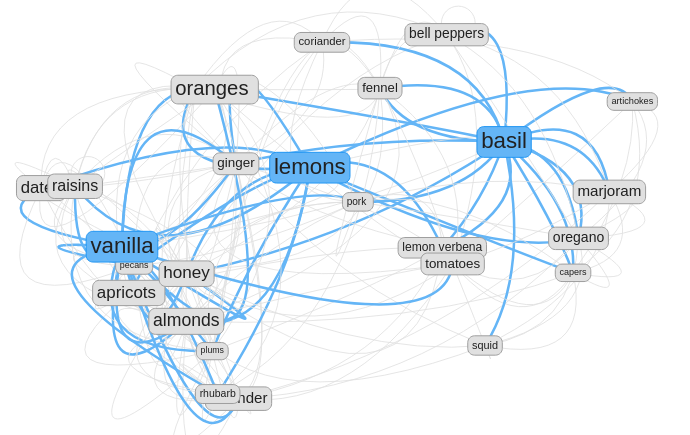

# The Flavor Network

This repository contains the website source code for 
[flavorpair.me](https://flavorpair.me),
a creativity tool that empowers chefs and bartenders to build recipes starting from flavor pairing fundamentals.



## Overview

The website is built with the [Hugo](https://gohugo.io), a static site generator, using the 
[papermod theme](https://github.com/adityatelange/hugo-PaperMod/),
which is served through a [nginx](https://nginx) reverse proxy.

The visualization makes use of two main libraries: 

1. [vis.js](https://visjs.org) for visualization of the network graph
2. [fuse.js](https://www.fusejs.io/) for searching

The network was constructed by creating a dataset out of [The Flavor Bible](https://karenandandrew.com/books/the-flavor-bible/), which is hosted statically on the website via JSON files.
The code to generate this dataset can be found in a companion repository [here](https://github.com/brege/flavor-project). 

The third module is a custom recipe searcher. This uses a dataset constructed from over 200,000 recipes on [food.com](https://food.com) (fmr. genius kitchen), which can be found [on kaggle](https://www.kaggle.com/datasets/shuyangli94/food-com-recipes-and-user-interactions).

That dataset was turned into a SQLite database (see: /), where a custom WSGI API was built over Flask.
Recipes are dynamiccally updated as new ingredients are added or removed from the "proto" recipe ingredient list.
In short, all three modules (ingredient search, network visualization, recipe databse) are kept in sync with the user's input.

## Developement Server

Hugo has a built in developement server.  In `flavorpair.me/`, run 
```bash
hugo server
``` 

This is typically accessible at [http://localhost:1313](http://localhost:1313).

You will need two terminal windows open.  One for the hugo server, and one for the API backend server.

In order to use the recipe API, you'll need to initialize the SQL database.

1. Download [the kaggle dataset](https://www.kaggle.com/datasets/shuyangli94/food-com-recipes-and-user-interactions) and unpack it into `./db/data/`

2. Run a jupyter notebook server, `jupyter notebook` in `db/`, then load `csv_to_sql.ipynb` and begin running executing the cells.  This can take some time.

3. This will create a `food_dotcom.db` file.  On my production machine, I keep this database file in the same directory as `backend.py`: `/var/www/flask_recipe_api/food_dotcom.db`

4. The API can be started with
``` bash
python backend.py
```
which is what one does locally.  On the production machine https://flavorpair.me, however, the `systemd` service file used is provided in `db/flask-recipe-api.service` which adds an additional WSGI layer.

## Production Server

1. Much of the deployment of the site is encapsulated in the `./deploy` shell script, in the `flavorpair.me` source directory. T
his will build the site files locally via `hugo`, clean the site directory on the remote server, and then transfer the static site files to the remote server. 

2. The remote, as mentioned, also makes use of a `systemd` service file that controls the WSGI/Flask server API.  This is a separate process from hugo.  This only needs to be enabled once (located in `/etc/systemd/system/`):
```bash
sudo systemctl enable flask-recipe-api.service
```
Reload the daemon
```bash
sudo systemctl daemon-reload
```
and start the service
```bash
sudo systemctl start flask-recipe-api.service
```

### Hugo and Javascript

The way you develop javascript on top of a hugo site is usually done through shortcodes and partials. 
One word of caution here is that there is inherently two different variable declarations happening in such javascript, as often times you need to have hugo translate a local path to a relative URL or vice versa. 
One handy trick is to pass paths through HTML tag attributes within shortcodes.
The syntax can be confusing even to experienced hugo users.


